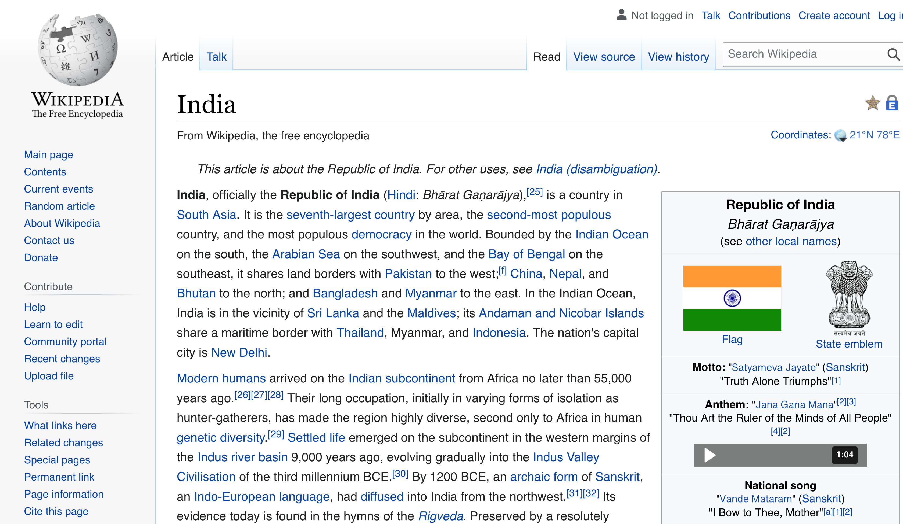
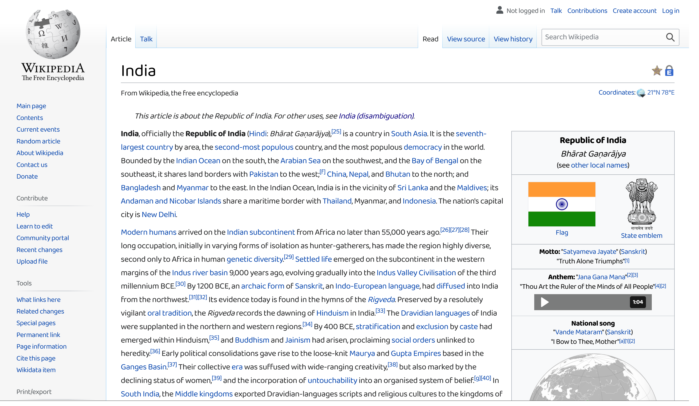
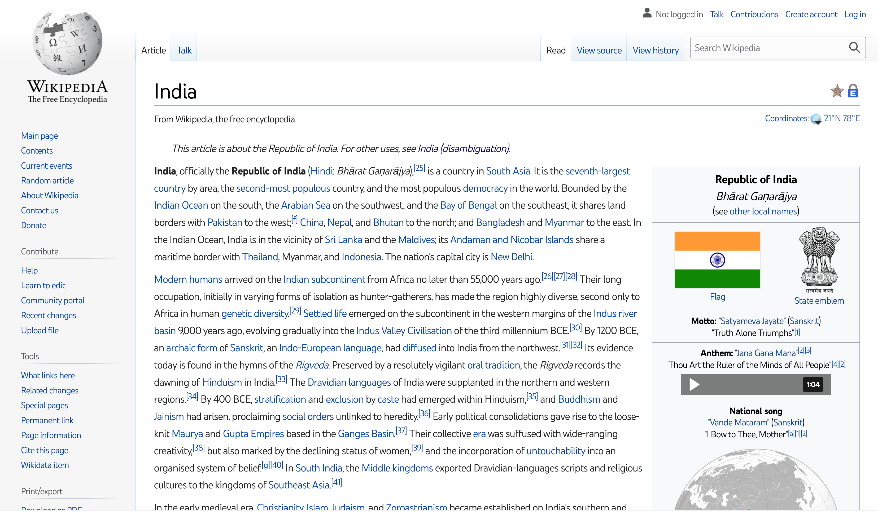
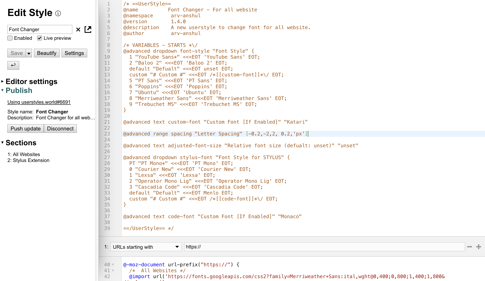
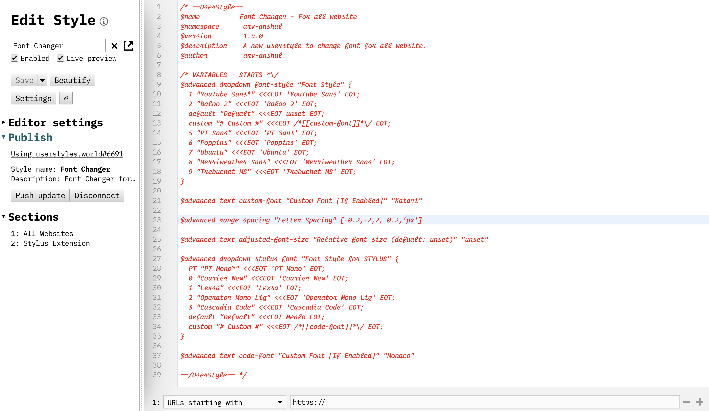

# Font Changer CSS For All Websites

Install my theme via clicking this link: [Font Changer CSS For All Websites](https://userstyles.world/style/6691/font-changer).

## Without Theme - Wikipedia

## With Theme - Wikipedia

## Without Theme - Stylus Code Editor

## With Theme - Stylus Code Editor

## Install Stylus Extension
### [For Firefox](https://addons.mozilla.org/en-US/firefox/addon/styl-us/)

### [For Chrome](https://chrome.google.com/webstore/detail/stylus/clngdbkpkpeebahjckkjfobafhncgmne)

# Thank You !! :blush: